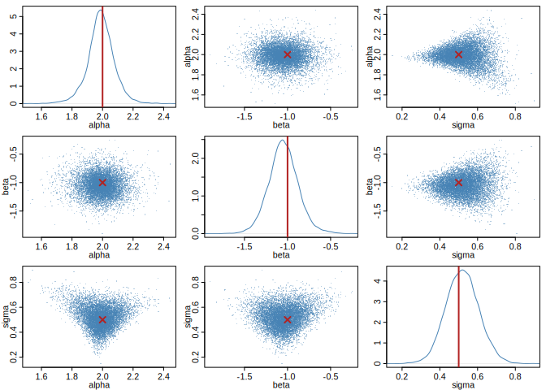

<!-- README.md is generated from README.Rmd. Please edit that file, then run rmarkdown::render("README.Rmd"). -->

# neuralsbi

<!-- badges: start -->

[](https://github.com/pedroliman/neuralsbi/actions/workflows/R-CMD-check.yaml)
[](https://pedroliman.github.io/neuralsbi/)
<!-- badges: end -->

`neuralsbi` is an R-native package for [Neural Simulation-based
inference](https://simulation-based-inference.org).

Neural estimators are implemented directly in R on the
[`torch`](https://torch.mlverse.org/) R package.

## Installation

``` r
# install.packages("remotes")
remotes::install_github("pedroliman/neuralsbi")

# the neural back end (once)
install.packages("torch")
torch::install_torch()
```

## Usage

Simulation-based inference fits a posterior from a prior and a
simulator, with no likelihood required. To keep the setup familiar, here
is ordinary linear regression written as a simulator: a response `y`
scattered around a line, `y ~ Normal(alpha + beta * x, sigma)` — the
same model you might write in Stan. Its likelihood is easy to write
down, which is exactly what makes it a good check: we know the
coefficients that generated the data, so we can confirm the posterior
recovers them.

``` r
library(neuralsbi)
set.seed(1)

# Regression design: a single covariate x, measured at 50 fixed points.
N <- 50
x <- seq(-1, 1, length.out = N)

# Simulator: given (alpha, beta, sigma), draw one response vector y from
# y ~ Normal(alpha + beta * x, sigma). It only generates data — no fitting here.
simulator <- function(theta) {
  t(apply(theta, 1, function(p) rnorm(N, mean = p[1] + p[2] * x, sd = p[3])))
}

# Priors over the intercept, slope, and noise scale, then train the posterior.
prior <- prior_uniform(low = c(-3, -3, 0.1), high = c(3, 3, 2))
fit   <- npe(prior, simulator, n_simulations = 5000, seed = 1)

# Simulate one data set from known coefficients, then infer them back. The
# observation the posterior conditions on is the response vector y.
theta_true <- c(alpha = 2, beta = -1, sigma = 0.5)
y_obs      <- simulator(rbind(theta_true))
post       <- posterior(fit, x_obs = y_obs)
draws      <- sample(post, 10000)
```

The posterior mean recovers the coefficients that generated the data:

``` r
rbind(truth = theta_true, posterior_mean = colMeans(draws))
#>                   alpha      beta     sigma
#> truth          2.000000 -1.000000 0.5000000
#> posterior_mean 1.989139 -1.047011 0.5194744
```

``` r
pairplot(draws, truth = theta_true, labels = c("alpha", "beta", "sigma"))
```



The same posterior gives a point estimate; calibration checks such as
simulation-based calibration live in `vignette("diagnostics")`.

``` r
map_estimate(post)     # posterior mode
#> [1]  1.9931949 -1.0567096  0.4637602
```

If you’re interested in sbi in other languages or functionality not
available here, see the [awesome neural SBI
repo](https://github.com/smsharma/awesome-neural-sbi); there are some
good implementations in python and in Julia.

## Learn more

The [package website](https://pedroliman.github.io/neuralsbi/) has four
vignettes that build on each other:

1.  [Getting
    started](https://pedroliman.github.io/neuralsbi/articles/neuralsbi.html)
    — the core prior/simulator/posterior workflow.
2.  [Choosing a density
    estimator](https://pedroliman.github.io/neuralsbi/articles/density-estimators.html)
    — MDN, MAF, NSF, and the torch-free baseline.
3.  [Checking the
    posterior](https://pedroliman.github.io/neuralsbi/articles/diagnostics.html)
    — calibration and predictive diagnostics.
4.  [Case study: an SIR epidemic
    model](https://pedroliman.github.io/neuralsbi/articles/sir-epidemic.html)
    — the full Bayesian workflow on an applied problem.

## License

MIT
